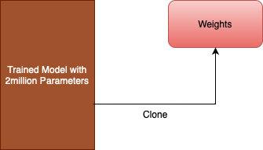

# LoRA
PyTorch implementation demonstrating Low Rank Adaption (LoRA) in Neural Networks, for efficient model compression and fine-tuning on domain specific tasks

## Purpose

The primary objective of this study is to train a base neural network model and subsequently fine-tune it using the Low Rank Adaptation (LoRA) technique. The fine-tuning process aims to enhance the model's accuracy. Furthermore, post-fine-tuning observations demonstrate that the added parameters do not disturb the original parameters. Instead, the analysis reveals the addition of minimal new parameters.

## Dataset

The chosen dataset for this study is the [MNIST dataset](http://yann.lecun.com/exdb/mnist/). The choice of MNIST as the experimental dataset provides a standardized foundation for evaluating the effectiveness of low-rank adaptation techniques in the context of image recognition.

## MNIST Model

The Neural Network architecture utilized for this demonstration comprises 2 million parameters distributed across three linear layers. This architectural configuration was designed to explore the efficacy of low-rank adaptation techniques within the context of a neural network model with considerable complexity and parameterization.

### Model Summary

## Model Training

The model training is executed for a single epoch, utilizing the Cross Entropy loss function. The chosen optimizer is Adam, configured with a learning rate of 0.001.

### Training Logs

`Epoch 1: 100%|██████████| 6000/6000 [00:31<00:00, 189.28it/s, loss=2.07]`

### Clone Weights

To prove that the Original weights are not distrubed, they are preserved through cloning them. This preservation facilitates subsequent validation, demonstrating that fine-tuning with Low Rank Adaptation did not induce any alteration to the original weights.

## Model Testing

### Testing Logs

`Testing: 100%|██████████| 1000/1000 [00:05<00:00, 182.07it/s]
Accuracy : 0.21`

## Trained Model Observation

Prior to initiating the fine-tuning process with the LoRA configuration, a comprehensive examination of the original model's parameter count is conducted.

Total number of parameters: `2,807,010`
