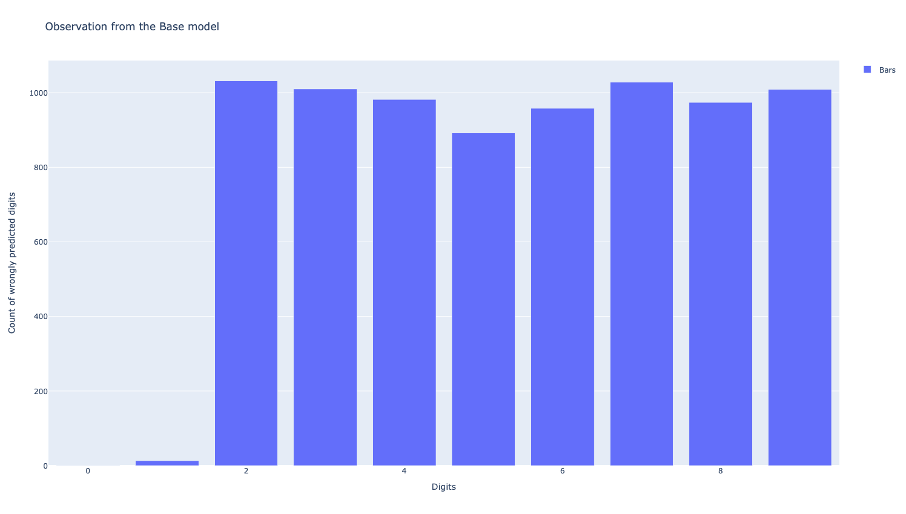
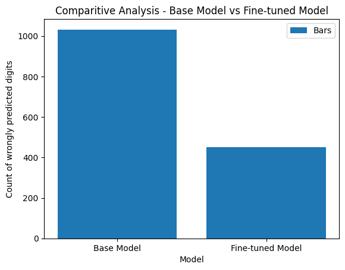

# LoRA
PyTorch implementation demonstrating Low Rank Adaption (LoRA) in Neural Networks, for efficient model compression and fine-tuning on domain specific tasks

## Purpose

The primary objective of this study is to train a base neural network model and subsequently fine-tune it using the Low Rank Adaptation (LoRA) technique. The fine-tuning process aims to enhance the model's accuracy. Furthermore, post-fine-tuning observations demonstrate that the added parameters do not disturb the original parameters. Instead, the analysis reveals the addition of minimal new parameters.

## Dataset

The chosen dataset for this study is the [MNIST dataset](http://yann.lecun.com/exdb/mnist/). The choice of MNIST as the experimental dataset provides a standardized foundation for evaluating the effectiveness of low-rank adaptation techniques in the context of image recognition.

## MNIST Model

The Neural Network architecture utilized for this demonstration comprises 2 million parameters distributed across three linear layers. This architectural configuration was designed to explore the efficacy of low-rank adaptation techniques within the context of a neural network model with considerable complexity and parameterization.

### Model Summary

## Model Training

The model training is executed for a single epoch, utilizing the Cross Entropy loss function. The chosen optimizer is Adam, configured with a learning rate of 0.001.

### Training Logs

`Epoch 1: 100%|██████████| 6000/6000 [00:31<00:00, 189.28it/s, loss=2.07]`

### Clone Weights

To prove that the Original weights are not distrubed, they are preserved through cloning them. This preservation facilitates subsequent validation, demonstrating that fine-tuning with Low Rank Adaptation did not induce any alteration to the original weights.

## Model Testing

### Testing Logs

`Testing: 100%|██████████| 1000/1000 [00:05<00:00, 182.07it/s]
Accuracy : 0.21`

## Trained Model Observation

Prior to initiating the fine-tuning process with the LoRA configuration, a comprehensive examination of the original model's parameter count is conducted.

Total number of parameters: `2,807,010`

## LoRA Parameterization

The LoRA_Parameterization model is initialized with two matrices, namely A and B. Matrix B is characterized by the shape (d, rank), where 'd' represents the size of the input features, and 'rank' signifies the specified rank, a parameter subject to variation in experimental settings. On the other hand, Matrix A is defined with a shape of (rank, k), where 'k' denotes the size of the output features.

* During the initialization phase, `Matrix A` is endowed with values drawn from a Gaussian distribution, imparting a degree of randomness to the matrix. Concurrently, `Matrix B` is initialized with zeros. This deliberate configuration is designed to enforce the condition that the product of matrices `B` and `A`, represented as $∆W = BA$, attains a zero value at the outset of the training process. 

* After making adjustments to the model's parameters $∆W * x$, the result is multiplied by $α/r$; where $α$ is a constant related to the adjustments.

* When using the Adam optimization method, choosing $α$ is similar to choosing the learning rate, especially if the initial values are properly adjusted.

* To simplify things, the $α$ is set to the first value of $r$, that is tried and not changed afterwards.

* This scaling process, helps avoiding the need to fine-tune other parameters when experimented with different values of $r$

### Quantitaive assessment of Parameters introduced by `LoRA`

* The originally model encompasses a total of `2,807,010` parameters. $weights + bias$ (2804000 + 3010)
* The LoRA process results in the updating of `6,794` parameters. This increment represents a `0.24%` increase in the total number of parameters compared to the original model.
* Post the integration of the LoRA technique, the model undergoes modifications, resulting in a revised parameter count of `2,813,804 (2,807,010 + 6,794)`. This figure encapsulates the cumulative impact of the LoRA process on the overall parameterization of the model.

## Model Fine-tuning

### Freeze Model's Non-LoRA Parameters

During the fine-tuning stage, a critical approach is employed whereby the original parameters of the model are immutably frozen. Exclusive focus is directed towards the adjustment of parameters introduced by Low Rank Adaptation (LoRA) during the back-propagation process. This meticulous design guarantees that only the LoRA-introduced parameters undergo adaptation, safeguarding the stability and preservation of the original model configuration.

### Prepare dataset for the Fine-tuning

For the purposes of this demonstration, the digit 2 is identified as a specific domain of interest within the dataset. Notably, [observations](https://github.com/bala1802/LoRA/blob/main/README.md#testing-logs) reveal that the performance of the digit 2 is comparatively lower than that of other digits. In preparation for fine-tuning, a specialized dataset is curated, exclusively containing images of the digit 2.

### Result

The fine-tuning process is exclusively applied to the dataset containing images of the digit `2`, with the anticipation that this targeted refinement will lead to improved performance and a reduction in error.

Comparitive analysis is conducted to assess the performance of the the digit `2` both before and after applying the LoRA technique.

The above comparitive analysis' visual representation proves that fine-tuning the model, with the addition of a minimal number of parameters through Low Rank Adaptation (LoRA), results in a notable enhancement in performance for domain-specific tasks.
